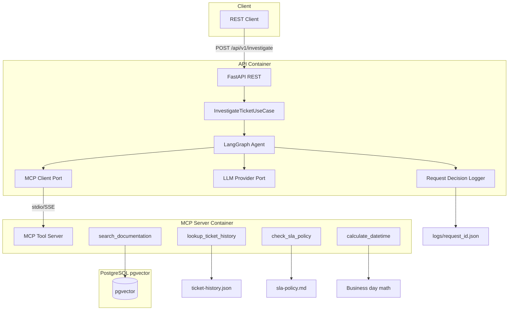
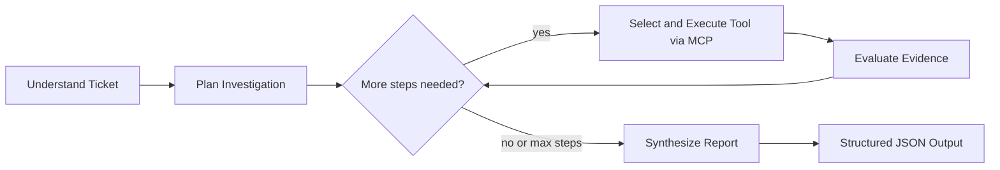

# NovaTech Intelligent Support Agent — Implementation Plan

## Current State

The repo contains **only mock data** ([`data/raw_docs/`](data/raw_docs/), [`data/ticket-history.json`](data/ticket-history.json)) and a single git commit. No application code, specs, or Docker setup exist yet.

The provided materials support all three example tickets well:
- **Ticket 1 (NT-4523):** [`troubleshooting-guide.md`](data/raw_docs/troubleshooting-guide.md), [`known-issues.md`](data/raw_docs/known-issues.md) KI-2402-001, prior ticket TK-20235
- **Ticket 2 (Atlas, multi-ticket):** TK-20251 (sync), TK-20240-ish scheduling (Atlas field service ticket in history), KI-2402-003/004, SLA tables in [`sla-policy.md`](data/raw_docs/sla-policy.md)
- **Ticket 3 (ambiguous slowness):** KI-2402-006, KB performance article, TK-20252 as similar historical case

---

## Architecture Overview



### Agent Reasoning Flow (dynamic, not a fixed pipeline)



**Key design choice:** LangGraph state machine with a **Planner node** that writes a ticket-specific investigation plan (ordered tool intents), and a **Router/Executor loop** that can revise the plan when evidence is insufficient or conflicting. Different tickets produce different plans (e.g., NT-4523 → doc search + ticket history; vague slowness → broad doc search + patch notes + similar tickets + low-confidence synthesis).

### Tools vs Skills (documented in SPECIFICATION.md)

| Layer | Examples | Implementation |
|---|---|---|
| **Tools** (deterministic MCP calls) | `lookup_ticket_history`, `check_sla_policy`, `calculate_datetime` | MCP server; thin wrappers over JSON/MD parsing |
| **Skills** (multi-step, judgment-heavy) | Documentation search & retrieval, synthesis | MCP `search_documentation` (retrieve + rank + assemble context); LangGraph synthesis node (LLM over aggregated evidence) |

---

## Clean Architecture Layout

```
nova-support-agent/
├── AGENTS.md                    # Coding standards, SOLID, layer rules
├── SPECIFICATION.md             # System blueprints, schemas, agent contract
├── README.md
├── requirements.txt
├── docker-compose.yml
├── .env.example
├── docs/
│   ├── architecture.md          # 1–2 pages + design decisions
│   └── architecture.drawio      # High-level diagram (editable)
├── src/
│   ├── domain/                  # Entities, value objects, port interfaces
│   ├── use_cases/               # InvestigateTicket, IngestDocuments
│   ├── infrastructure/          # LLM, pgvector, MCP client, file readers
│   ├── agent/                   # LangGraph state, nodes, graph assembly
│   └── api/                     # FastAPI app, DTOs, dependency injection
├── mcp_server/                  # Standalone MCP tool server
├── scripts/ingest_documents.py
├── tests/unit/ + tests/integration/
├── logs/                        # gitignored; one JSON log per request
└── data/                        # existing mock data (mounted read-only)
```

**SOLID highlights:**
- **Dependency Inversion:** `LLMProvider`, `VectorStore`, `MCPToolClient`, `RequestLogger` are domain ports; Groq/OpenAI/Ollama and pgvector are infrastructure adapters selected via config
- **Single Responsibility:** Each LangGraph node does one job; MCP tools do one lookup each
- **Open/Closed:** New LLM provider = new adapter class, no agent graph changes

---

## Phase 0 — Spec Baseline (First Deliverable)

Create before any production code:

### [`AGENTS.md`](AGENTS.md)
- Python 3.11+, strict PEP 8, Ruff formatting/linting
- Explicit type hints on all public functions/methods
- Clean Architecture layer dependency rule (domain → nothing; use_cases → domain; infrastructure/api → use_cases + domain)
- SOLID expectations with examples (e.g., inject `LLMProvider`, never import Groq in domain)
- Test-first incremental loop: one component → pytest → confirm before next
- Commit message and naming conventions

### [`SPECIFICATION.md`](SPECIFICATION.md)
- Problem statement and non-goals (PoC, not production UI)
- Agent contract: 5-step behavior (understand → plan → investigate → reason → report)
- **Input schema** (support ticket JSON):

```json
{
  "subject": "string",
  "body": "string",
  "customer": "string",
  "supportTier": "standard | premium",
  "createdAt": "ISO-8601 optional",
  "ticketReferences": ["TK-20251"] 
}
```

- **Output schema** (resolution report JSON): `diagnosis`, `recommendedResolution[]`, `confidenceLevel` + `confidenceRationale`, `slaStatus`, `sources[]`, `escalationRecommendation`, `investigationGaps[]`, `investigationTrace[]`
- LangGraph state schema and node responsibilities
- MCP tool contracts (name, params, return shape)
- LLM provider interface + env config keys
- Tenant isolation rule: all ticket/history lookups scoped by `customer`; tests must prove cross-customer access is blocked
- Observability: per-request log file format in `logs/{request_id}.json`

---

## Phase 1 — Foundation (Build-Test-Learn)

Each bullet = one cycle (implement → pytest → review → confirm before next).

### 1.1 Domain Layer
- Entities: `SupportTicket`, `InvestigationPlan`, `EvidenceItem`, `ResolutionReport`, `SLAStatus`
- Ports: `LLMProvider`, `VectorStore`, `MCPToolClient`, `RequestLogger`, `DocumentRepository`
- Pydantic models for API I/O mirroring SPECIFICATION schemas

**Tests:** schema validation, immutability of value objects, port contract fakes

### 1.2 LLM Provider Abstraction (default: **Groq**)
- Abstract base in `src/domain/ports/llm_provider.py`
- Adapters: `GroqLLMProvider`, `OpenAIProvider`, `OllamaProvider`
- Factory: `LLM_PROVIDER=groq|openai|ollama` from [`.env.example`](.env.example)

**Tests:** mock HTTP; verify each adapter implements same interface; factory selects correct provider

### 1.3 Vector Store + Document Ingestion
- PostgreSQL + pgvector via Docker ([`docker-compose.yml`](docker-compose.yml) service `postgres`)
- Chunking strategy: markdown-aware splits by `##` headers, ~500 token chunks, metadata `{source_file, section, module_tags}`
- Embeddings: configurable (default `text-embedding-3-small` for OpenAI path; Groq-compatible embedding via same OpenAI-compatible endpoint or local Ollama embeddings — adapter pattern)
- [`scripts/ingest_documents.py`](scripts/ingest_documents.py) for manual dev use
- Compose entrypoint: **auto-ingest if `document_chunks` table is empty** (user preference)

**Tests:** integration test with testcontainers or mocked pgvector; verify chunk count matches raw docs; tenant-agnostic docs (global KB)

### 1.4 MCP Tool Server
Standalone container exposing tools via MCP (Python `mcp` SDK / FastMCP):

| Tool | Behavior |
|---|---|
| `search_documentation` | Semantic search pgvector; returns ranked chunks with source refs |
| `lookup_ticket_history` | Filter [`ticket-history.json`](data/ticket-history.json) by ticket ID, customer, tags, keyword; **enforce customer scope** |
| `check_sla_policy` | Parse tier + severity → response/resolution deadlines, escalation triggers |
| `calculate_datetime` | Business hours remaining, deadline computation, date diffs |

**Tests:** unit tests per tool with fixture data; integration test MCP client ↔ server handshake (mocked)

---

## Phase 2 — LangGraph Agent

### State (`AgentState`)
- `ticket`, `understanding`, `plan`, `evidence[]`, `tool_calls[]`, `iteration_count`, `confidence`, `report`

### Nodes
1. **`understand_ticket`** — LLM structured extraction: module, error codes, tier, urgency, referenced ticket IDs (handles Ticket 2 ambiguity: `#NT-4523` may be error code vs ticket ref)
2. **`plan_investigation`** — LLM generates ordered investigation steps with rationale (not hardcoded)
3. **`execute_next_step`** — Maps plan step → MCP tool call; appends to evidence
4. **`evaluate_evidence`** — LLM decides: sufficient / need more / conflicting; may append revised plan steps
5. **`synthesize_report`** — LLM produces structured `ResolutionReport`; explicitly sets low confidence + gaps for Ticket 3

### Graph control
- Conditional edge from `evaluate_evidence`: loop (max 8 iterations) or synthesize
- Hard guardrails: always call SLA tool when tier known; always search docs when error code present

**Tests:**
- Unit: each node with mocked LLM + MCP responses
- Integration: Ticket 1 end-to-end (mock Groq) asserts NT-4523 diagnosis, legacy endpoint workaround, confidence ≥ medium
- Ticket 2: both referenced tickets looked up, SLA computed, prioritization reasoning present
- Ticket 3: `investigationGaps` non-empty, confidence low/medium, escalation suggested

---

## Phase 3 — REST API + Observability

### FastAPI ([`src/api/main.py`](src/api/main.py))
- `POST /api/v1/investigate` — accepts ticket JSON, returns resolution report JSON
- `GET /health` — liveness for compose
- `POST /api/v1/investigate` generates UUID `request_id`; all agent decisions logged

### Request Decision Logger
- File: `logs/{request_id}.json`
- Contents: timestamp, input ticket, each node entry/exit, LLM prompts summaries (not full secrets), tool calls + results, final report, elapsed ms
- Port interface `RequestLogger` → `FileRequestLogger` infrastructure adapter

**Tests:** API contract test; verify log file created with expected decision trace fields

---

## Phase 4 — Containerization

[`docker-compose.yml`](docker-compose.yml) services:

| Service | Image / Build | Notes |
|---|---|---|
| `postgres` | `pgvector/pgvector:pg16` | Volume for data; healthcheck |
| `mcp-server` | Build [`mcp_server/Dockerfile`](mcp_server/Dockerfile) | Connects to postgres; mounts `data/` |
| `api` | Build [`Dockerfile`](Dockerfile) | Depends on postgres + mcp-server; runs ingest-if-empty then uvicorn |

Environment via `.env.example`: `LLM_PROVIDER=groq`, `GROQ_API_KEY`, DB URL, MCP server URL.

---

## Phase 5 — Documentation

### [`README.md`](README.md)
- Prerequisites (Docker, Python 3.11)
- Quick start: `docker compose up`, curl example for Ticket 1
- Switch LLM provider
- Run tests: `pytest`
- Manual ingest script usage

### [`docs/architecture.md`](docs/architecture.md) (1–2 pages)
- Framework choice rationale:
  - **LangGraph:** cyclic agent loops, explicit state, conditional routing (vs fixed LangChain chain)
  - **LangChain:** embeddings, document loaders, LLM adapter utilities
  - **MCP:** tool isolation, testable tool server, aligns with dockerized architecture
- Reasoning flow diagram (reference drawio)
- Key trade-offs table (e.g., Groq default for speed/cost vs Ollama for offline; pgvector vs in-memory FAISS; max iteration guard vs unbounded agent loops)
- Skills vs tools distinction

### [`docs/architecture.drawio`](docs/architecture.drawio)
- Boxes: Client, REST API, Use Case, LangGraph Agent, LLM Providers, MCP Server, Tools, pgvector, Log Files, Mock Data
- Arrows showing request flow and tool call path

---

## Ticket Priority (Incremental Validation)

| Priority | Ticket | Success Criteria |
|---|---|---|
| P0 | Ticket 1 | Finds NT-4523, KI-2402-001, TK-20235; recommends legacy endpoint + schedule migration; high confidence |
| P1 | Ticket 2 | Looks up TK-20251 + scheduling ticket; SLA for Standard tier; explains related but distinct issues (KI-2402-003 vs KI-2402-004); prioritization rationale |
| P2 | Ticket 3 | Broad investigation; cites KI-2402-006; honest uncertainty; recommends diagnostics + human escalation |

---

## Key Dependencies ([`requirements.txt`](requirements.txt))

```
fastapi, uvicorn, pydantic, pydantic-settings
langgraph, langchain, langchain-core, langchain-openai, langchain-groq, langchain-community
psycopg[binary], pgvector, sqlalchemy
mcp / fastmcp
httpx, python-dotenv
pytest, pytest-asyncio, pytest-mock, testcontainers (optional)
ruff
```

---

## SDD Process (How We Will Work)

For **every** component above:
1. **Build** — single module only, respecting layer boundaries
2. **Test** — pytest with mocked externals; tenant isolation test where applicable
3. **Learn** — run tests, note structural insights
4. **Confirm** — pause for your approval before the next component

**Immediate next action after plan approval:** Generate [`AGENTS.md`](AGENTS.md) and [`SPECIFICATION.md`](SPECIFICATION.md) as the technical baseline, then begin Phase 1.1 (domain layer).
